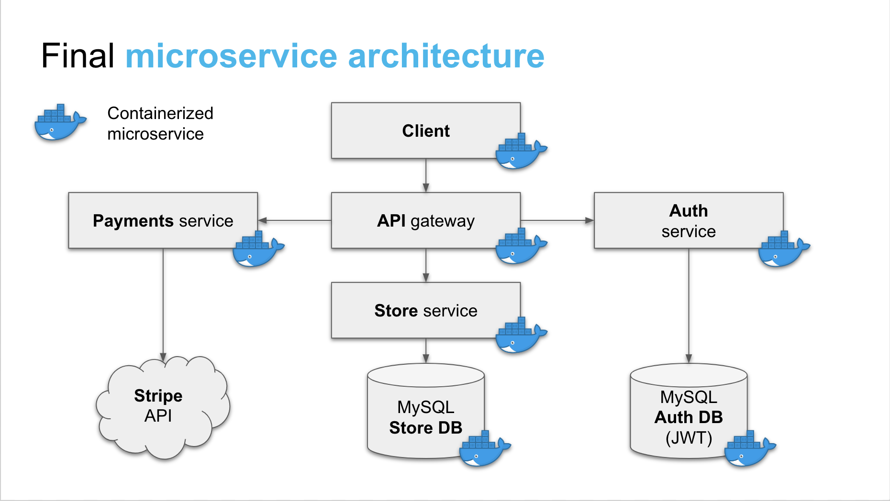

# Storeo

[](https://travis-ci.com/felixweinberger/storeo-server)

Storeo is an open-source ecommerce framework that allows developers to effortlessly setup an online store.
It's built around clear design principles that make it modular, extendible, and easy to get up and running.

This repo is the back-end of the app, you can find the front-end [here](https://github.com/felixweinberger/Storeo-FE).


## Getting started

1. Make sure that you have [Docker](https://www.docker.com/) installed. We recommend the official desktop app for your operating system.

2. Follow the `'.env.example'` file to create your own '.env' file. 

3. After installing docker, clone the repo, build and run the backend with docker-compose:

```sh
# Get the backend up and running
mkdir ~/projects/storeo
cd ~/projects/storeo
git clone https://github.com/felixweinberger/Storeo-server
docker-compose build
docker-compose up

# Get the frontend up and running (in a separate terminal)
cd ~/projects/storeo
git clone https://github.com/felixweinberger/Storeo-FE
docker-compose build
docker-compose up
```

4. Point your browser to `http://localhost:80/` to see Storeo in action

5. An exhaustive Postman collection has been added for your convenience inside the `postman` folder of the repository.

## More resources 

Find a diagram of the database structure [here](https://imgur.com/a/6pRzUzW)

## Tech Stack

* [Node.js](https://nodejs.org/en/)
* [Express](https://expressjs.com/)
* [MySQL](https://www.mysql.com/)
* [Sequelize](http://docs.sequelizejs.com/)
* [JSON Web Tokens](https://www.npmjs.com/package/jsonwebtoken)
* [Faker.js](https://github.com/Marak/faker.js)
* [Stripe](https://stripe.com/docs)
* [Docker](https://www.docker.com/)
* [TravisCI](https://travis-ci.com/)

The original monolith structure was refactored to a microservice architecture leveraging Docker for containerization to improve modularity and developer ramp-up time.



